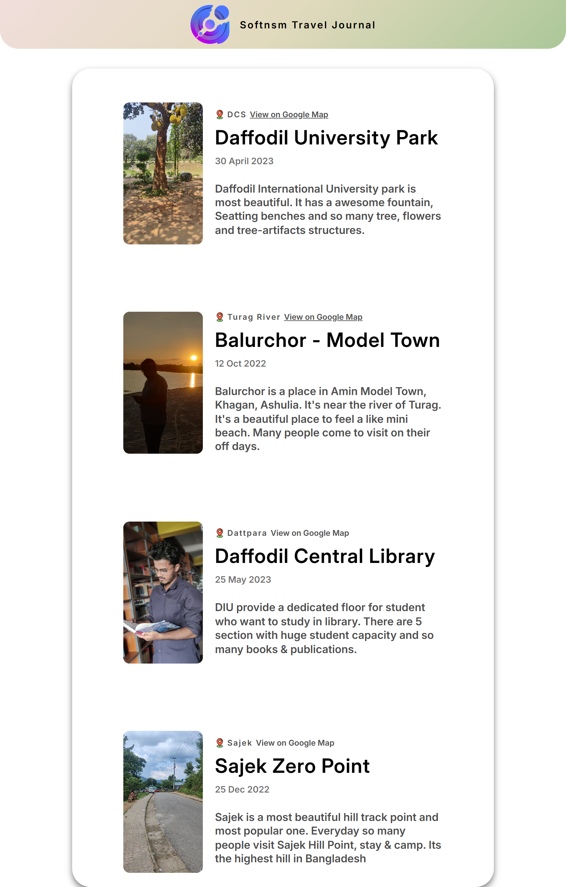

# Travel Journal for SoftNSM

### This is a travel journal for SoftNSM Employees, Where they visit and what are their experience

## Core Features:
1. Journal:
    1. Image snap
    2. Location of the travel point
    3. Details of experience

## Core Learning:
1. Props
 - How Props works as object and how to use it
2. Styling:
 -Some new properties of CSS been on development of this project and learn something from it.
3. Data structure:
 - Used data.js to hold the data
 - Get the data using mapping and passing the data to props
 - use of menual and ES6 way with Spread operators

## Frontend User Interface:

    